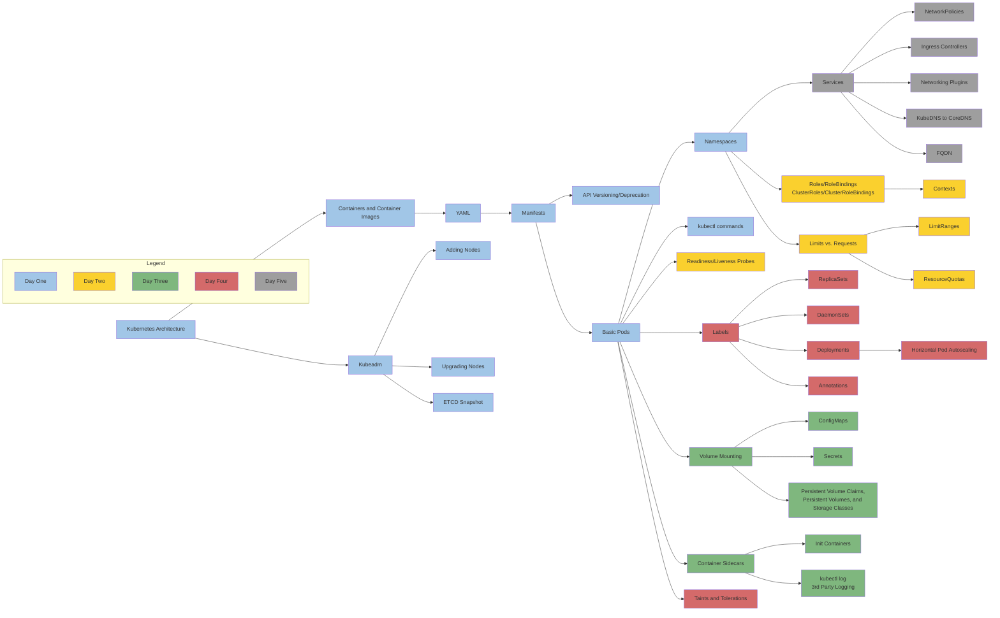

```mermaid
flowchart LR
	A["<span style=&quot;color:black;&quot;>Kubernetes Architecture</span>"] --> B["<span style=&quot;color:black;&quot;>Containers and Container Images</span>"]
	style A fill:#A1C6E7
	style B fill:#A1C6E7
	B --> C["<span style=&quot;color:black;&quot;>YAML</span>"]
	style C fill:#A1C6E7
	C --> D["<span style=&quot;color:black;&quot;>Manifests</span>"]
	style D fill:#A1C6E7
	D --> F["<span style=&quot;color:black;&quot;>API Versioning/Deprecation</span>"]
	style F fill:#A1C6E7
	E["<span style=&quot;color:black;&quot;>Basic Pods</span>"] --> G["<span style=&quot;color:black;&quot;>Namespaces</span>"]
	style E fill:#A1C6E7
	style G fill:#A1C6E7
	E --> I["<span style=&quot;color:black;&quot;>kubectl commands</span>"]
	style I fill:#A1C6E7
	E --> J["<span style=&quot;color:black;&quot;>Readiness/Liveness Probes</span>"]
	style J fill:#FAD02E
	P["<span style=&quot;color:black;&quot;>Volume Mounting</span>"] --> Q["<span style=&quot;color:black;&quot;>ConfigMaps</span>"]
	style P fill:#7FB77E
	style Q fill:#7FB77E
	P --> R["<span style=&quot;color:black;&quot;>Secrets</span>"]
	style R fill:#7FB77E
	E --> V["<span style=&quot;color:black;&quot;>Labels</span>"]
	style V fill:#D46A6A
	V --> X["<span style=&quot;color:black;&quot;>ReplicaSets</span>"]
	style X fill:#D46A6A
	V --> Y["<span style=&quot;color:black;&quot;>DaemonSets</span>"]
	style Y fill:#D46A6A
	V --> Z["<span style=&quot;color:black;&quot;>Deployments</span>"]
	style Z fill:#D46A6A
	Z --> AA["<span style=&quot;color:black;&quot;>Horizontal Pod Autoscaling</span>"]
	style AA fill:#D46A6A
	G --> AE["<span style=&quot;color:black;&quot;>Services</span>"]
	style AE fill:#9E9E9E
	AE --> AD["<span style=&quot;color:black;&quot;>NetworkPolicies</span>"]
	style AD fill:#9E9E9E
	AE --> AF["<span style=&quot;color:black;&quot;>Ingress Controllers</span>"]
	style AF fill:#9E9E9E
	AE --> AG["<span style=&quot;color:black;&quot;>Networking Plugins</span>"]
	style AG fill:#9E9E9E
	E --> P
	E --> T["<span style=&quot;color:black;&quot;>Container Sidecars</span>"]
	style T fill:#7FB77E
	T --> U["<span style=&quot;color:black;&quot;>Init Containers</span>"]
	style U fill:#7FB77E
	P --> S["<span style=&quot;color:black;&quot;>Persistent Volume Claims,<br>Persistent Volumes, and Storage Classes</span>"]
	style S fill:#7FB77E
	G --> N["<span style=&quot;color:black;&quot;>Roles/RoleBindings<br>ClusterRoles/ClusterRoleBindings</span>"]
	style N fill:#FAD02E
	T --> O["<span style=&quot;color:black;&quot;>kubectl log<br>3rd Party Logging</span>"]
	style O fill:#7FB77E
	L["<span style=&quot;color:black;&quot;>Limits vs. Requests</span>"] --> M["<span style=&quot;color:black;&quot;>LimitRanges</span>"]
	style L fill:#FAD02E
	style M fill:#FAD02E
	G --> L
	E --> AC["<span style=&quot;color:black;&quot;>Taints and Tolerations</span>"]
	style AC fill:#D46A6A
	V --> W["<span style=&quot;color:black;&quot;>Annotations</span>"]
	style W fill:#D46A6A
	N --> 913349["<span style=&quot;color:black;&quot;>Contexts</span>"]
	style 913349 fill:#FAD02E
	D --> E
	L --> H["<span style=&quot;color:black;&quot;>ResourceQuotas</span>"]
	style H fill:#FAD02E
	AE --> 937820["KubeDNS to CoreDNS"]
	style 937820 fill:#9E9E9E
	AE --> 433216["FQDN"]
	style 433216 fill:#9E9E9E
	A --> 904797["Kubeadm"]
	style 904797 fill:#A1C6E7
	904797 --> 878614["Adding Nodes"]
	style 878614 fill:#A1C6E7
	904797 --> 341717["Upgrading Nodes"]
	style 341717 fill:#A1C6E7
	904797 --> 378911["ETCD Snapshot"]
	style 378911 fill:#A1C6E7
	subgraph Legend
		L1["<span style=&quot;color:black;&quot;>Day One</span>"]
		style L1 fill:#A1C6E7
		L2["<span style=&quot;color:black;&quot;>Day Two</span>"]
		style L2 fill:#FAD02E
		L3["<span style=&quot;color:black;&quot;>Day Three</span>"]
		style L3 fill:#7FB77E
		L4["<span style=&quot;color:black;&quot;>Day Four</span>"]
		style L4 fill:#D46A6A
		L5["<span style=&quot;color:black;&quot;>Day Five</span>"]
		style L5 fill:#9E9E9E
	end
```
