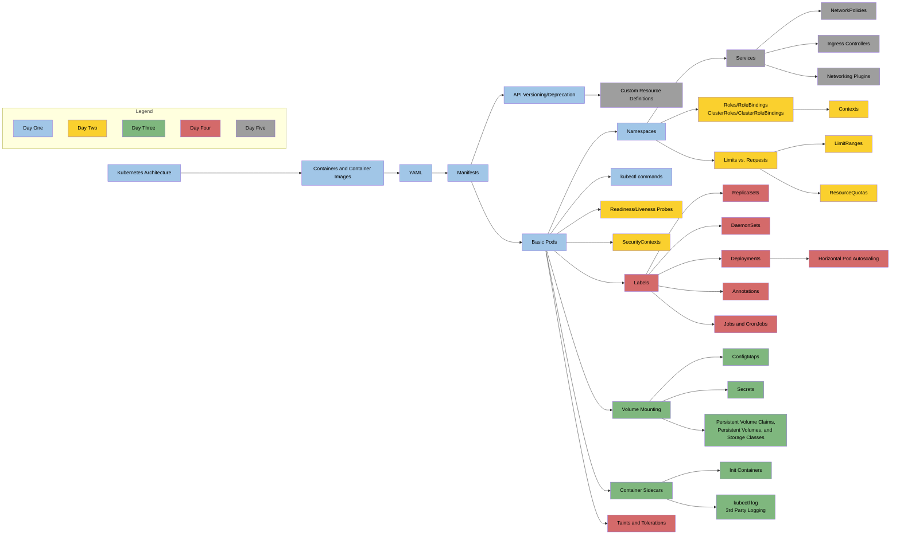

```mermaid
flowchart LR
    A["<span style='color:black;'>Kubernetes Architecture</span>"] --> B["<span style='color:black;'>Containers and Container Images</span>"]
    style A fill:#A1C6E7
    style B fill:#A1C6E7
    B --> C["<span style='color:black;'>YAML</span>"]
    style C fill:#A1C6E7
    C --> D["<span style='color:black;'>Manifests</span>"]
    style D fill:#A1C6E7
    D --> F["<span style='color:black;'>API Versioning/Deprecation</span>"]
    style F fill:#A1C6E7
    E["<span style='color:black;'>Basic Pods</span>"] --> G["<span style='color:black;'>Namespaces</span>"]
    style E fill:#A1C6E7
    style G fill:#A1C6E7
    E --> I["<span style='color:black;'>kubectl commands</span>"]
    style I fill:#A1C6E7
    E --> J["<span style='color:black;'>Readiness/Liveness Probes</span>"]
    style J fill:#FAD02E
    E --> K["<span style='color:black;'>SecurityContexts</span>"]
    style K fill:#FAD02E
    P["<span style='color:black;'>Volume Mounting</span>"] --> Q["<span style='color:black;'>ConfigMaps</span>"]
    style P fill:#7FB77E
    style Q fill:#7FB77E
    P --> R["<span style='color:black;'>Secrets</span>"]
    style R fill:#7FB77E
    E --> V["<span style='color:black;'>Labels</span>"]
    style V fill:#D46A6A
    V --> X["<span style='color:black;'>ReplicaSets</span>"]
    style X fill:#D46A6A
    V --> Y["<span style='color:black;'>DaemonSets</span>"]
    style Y fill:#D46A6A
    V --> Z["<span style='color:black;'>Deployments</span>"]
    style Z fill:#D46A6A
    Z --> AA["<span style='color:black;'>Horizontal Pod Autoscaling</span>"]
    style AA fill:#D46A6A
    G --> AE["<span style='color:black;'>Services</span>"]
    style AE fill:#9E9E9E
    AE --> AD["<span style='color:black;'>NetworkPolicies</span>"]
    style AD fill:#9E9E9E
    AE --> AF["<span style='color:black;'>Ingress Controllers</span>"]
    style AF fill:#9E9E9E
    AE --> AG["<span style='color:black;'>Networking Plugins</span>"]
    style AG fill:#9E9E9E
    E --> P
    E --> T["<span style='color:black;'>Container Sidecars</span>"]
    style T fill:#7FB77E
    T --> U["<span style='color:black;'>Init Containers</span>"]
    style U fill:#7FB77E
    P --> S["<span style='color:black;'>Persistent Volume Claims,<br>Persistent Volumes, and Storage Classes</span>"]
    style S fill:#7FB77E
    G --> N["<span style='color:black;'>Roles/RoleBindings<br>ClusterRoles/ClusterRoleBindings</span>"]
    style N fill:#FAD02E
    T --> O["<span style='color:black;'>kubectl log<br>3rd Party Logging</span>"]
    style O fill:#7FB77E
    L["<span style='color:black;'>Limits vs. Requests</span>"] --> M["<span style='color:black;'>LimitRanges</span>"]
    style L fill:#FAD02E
    style M fill:#FAD02E
    G --> L
    E --> AC["<span style='color:black;'>Taints and Tolerations</span>"]
    style AC fill:#D46A6A
    F --> AI["<span style='color:black;'>Custom Resource Definitions</span>"]
    style AI fill:#9E9E9E
    V --> W["<span style='color:black;'>Annotations</span>"]
    style W fill:#D46A6A
    V --> AB["<span style='color:black;'>Jobs and CronJobs</span>"]
    style AB fill:#D46A6A
    N --> 913349["<span style='color:black;'>Contexts</span>"]
    style 913349 fill:#FAD02E
    D --> E
    L --> H["<span style='color:black;'>ResourceQuotas</span>"]
    style H fill:#FAD02E

    subgraph Legend
        L1["<span style='color:black;'>Day One</span>"]
        L2["<span style='color:black;'>Day Two</span>"]
        L3["<span style='color:black;'>Day Three</span>"]
        L4["<span style='color:black;'>Day Four</span>"]
        L5["<span style='color:black;'>Day Five</span>"]
    end

    style L1 fill:#A1C6E7
    style L2 fill:#FAD02E
    style L3 fill:#7FB77E
    style L4 fill:#D46A6A
    style L5 fill:#9E9E9E
```
